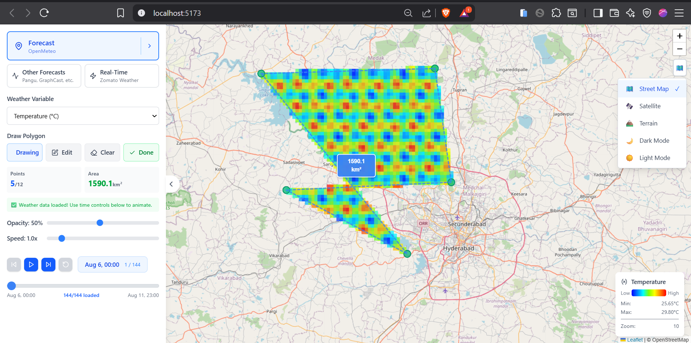
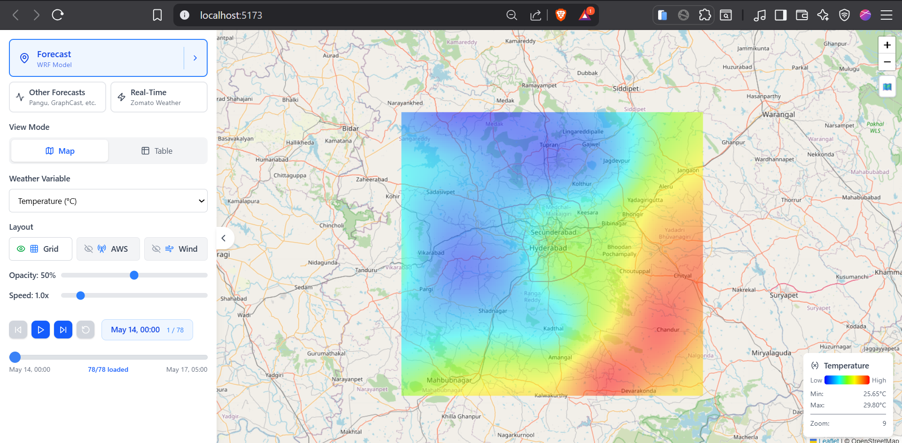
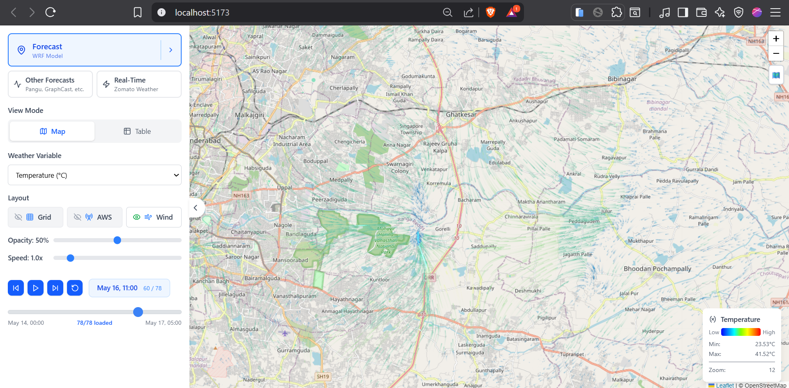
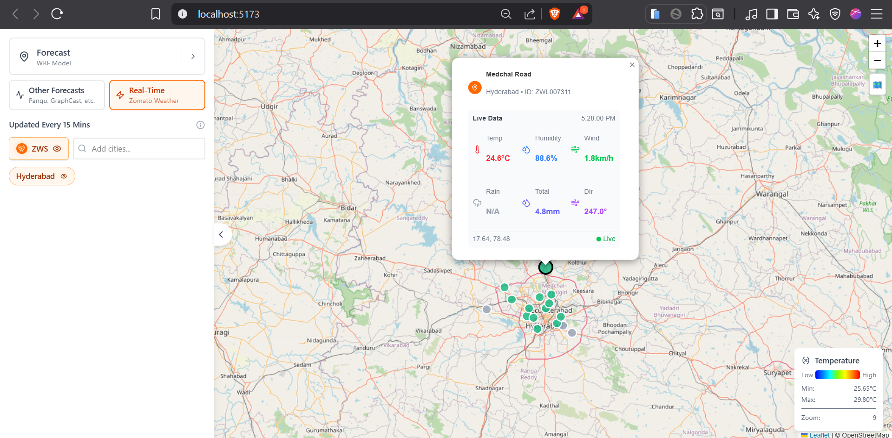
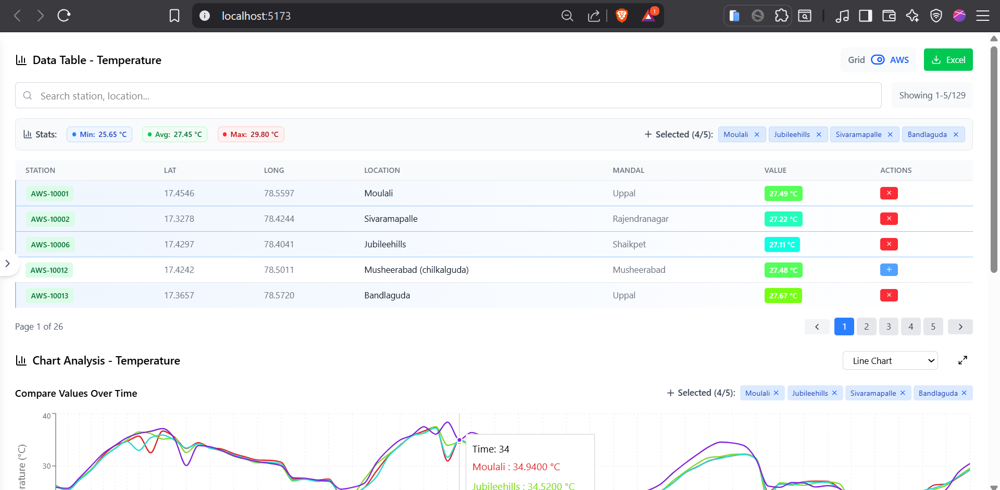

# Weather Forecast Visualization Platform

**Live Demo**: [https://mindwebs-openmeteo.vercel.app](https://mindwebs-openmeteo.vercel.app)  
**GitHub Repo**: [https://github.com/mondalsurojit/mindwebs_openmeteo](https://github.com/mondalsurojit/mindwebs_openmeteo)

## 📌 Overview

This is a React-based geospatial web application that visualizes high-resolution weather forecasts (e.g., temperature) using an interactive map built with Leaflet. The app is designed to help users explore spatial-temporal weather data in an intuitive and scalable way.

The application also integrates the WRF model output for a particular timestamp, on which 

> ⚠️ Note: The application currently displays only static OpenMeteo forecast data, directly loaded in the frontend.
To visualize high-resolution WRF model outputs (up to 1 sq. km), the backend needs to be activated. While it is not currently active, it can be enabled if required.


---

## ⚙️ Setup & Run Instructions

### Requirements

- Node.js ≥ 18  
- npm ≥ 9

### Steps

```bash
# Clone the repository
git clone https://github.com/mondalsurojit/mindwebs_openmeteo.git
cd mindwebs_openmeteo

# Install dependencies
npm install

# Run the development server
npm run dev
```

App will be served at: `http://localhost:5173`

---

## 📚 Libraries Used

| Library                 | Purpose                             |
| ----------------------- | ----------------------------------- |
| react                   | Core UI library                     |
| vite                    | Build and development server        |
| react-leaflet           | Map rendering with React            |
| leaflet                 | Interactive map engine              |
| @reduxjs/toolkit        | State management                    |
| react-redux             | React bindings for Redux            |
| tailwindcss             | Utility-first CSS framework         |
| lucide-react            | Icon library                        |
| recharts                | Lightweight charting                |
| @vitejs/plugin-react    | React plugin for Vite               |


---

## 🧠 Design / Development Remarks

- The map displays forecast layers like temperature, rainfall, humidity, and wind using preloaded static JSON data (for WRF model).  temperature (for OpenMeteo).
- A layer switcher allows toggling between variables.
- Custom legends are generated dynamically based on selected layers.
- The UI is mobile-responsive, minimal, and styled using Tailwind CSS.
- The codebase is modular, separating map logic, legends, and controls into clean React components.

---

## 🛰️ Backend Context (Not Deployed)

A backend (currently inactive) was developed to:

- Fetch and preprocess WRF model outputs from IIT Hyderabad’s pipeline
- Convert model data to frontend-compatible JSON formats
- Serve it via a REST API using Django

This integration is planned for future deployment.

---

## 📷 Screenshots

##### OpenMeteo Data - T2


##### WRF Model Data - T2 (Needs Backend run)


##### WRF Model Data - Wind


##### Zomato Weather Stations Live Data (Needs Backend run)


##### WRF Model Data - Dashboard & Visualization


---
## 👨‍💻 Author

**Surojit Mondal**  
Email: [surojitmondalit@gmail.com](mailto:surojitmondalit@gmail.com)  
GitHub: [https://github.com/mondalsurojit](https://github.com/mondalsurojit)  
Portfolio: [https://surojit.netlify.app](https://surojit.netlify.app)
